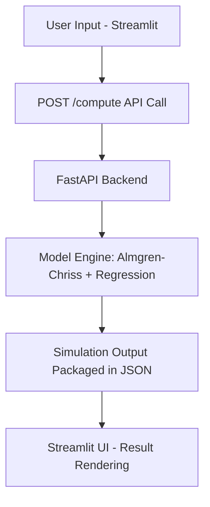

# Performance Analysis and Optimization

## Latency Benchmarking

### Metrics Measured

| Metric                      | Description                                                               |
| --------------------------- | ------------------------------------------------------------------------- |
| **Data Processing Latency** | Time taken by backend to compute simulation results after receiving input |
| **UI Update Latency**       | Time from receiving API response to rendering results in Streamlit        |
| **End-to-End Latency**      | Total time from clicking "Run Simulation" to full result display          |

### Measurement Technique

* Internal timestamps tracked using `time.time()` in the backend
* `latency_ms` returned as part of the response payload for reporting

---

## Optimization Techniques

### 1. Memory Management

* Used numpy arrays and matrix preallocation for value function and DP computation.
* Avoided recomputation via memoization of impact terms.

### 2. Network Communication

* Minimized JSON payload with flat schema
* Used lightweight FastAPI and Uvicorn for low-latency serving

### 3. Data Structure Selection

* Dynamic programming matrices: `value_function`, `best_moves`, and `inventory_path`
* Used integer indexing and float64 for computational precision and speed

### 4. Thread Management

* FastAPI supports async endpoints for concurrent processing
* Enabled async behavior in Colab using `nest_asyncio`

### 5. Model Efficiency

* **Regression Models:** Pre-fitted simple models for instant prediction
* **Almgren-Chriss:** Optimized with vectorized numpy operations and dynamic programming

---

## System Architecture Diagram

---

## Testing Instructions

### Unit Testing

* Validate regression outputs using synthetic inputs
* Verify Almgren-Chriss outputs for edge cases (e.g., zero volatility)

### Integration Testing

* Send full POST request and check for valid latency, slippage, and fee outputs

### UI Testing

* Run Streamlit locally and test various parameter combinations
* Confirm latency and result rendering without exceptions

---

## Performance Summary

| Aspect             | Strategy Used                    | Impact               |
| ------------------ | -------------------------------- | -------------------- |
| Latency            | Lightweight backend and async    | Fast UI response     |
| Scalability        | Stateless design + Pyngrok       | Easy to deploy       |
| Computational Load | Dynamic programming & regression | Efficient evaluation |

